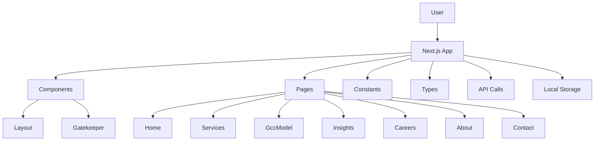

# gmx_website_feb_2026 — Enterprise Documentation

## 1. Executive Summary [HIGH]

**What this product ACTUALLY does:**
This is an enterprise-grade platform for building and scaling AI engineering teams and Global Capability Centers (GCCs) in India. It provides a comprehensive solution for AI product development, decision intelligence, and autonomous AI agent deployment. The core business problem it solves is helping global enterprises rapidly build high-performing AI engineering centers in India with enterprise-level discipline, operational excellence, and measurable business impact.

**Target Users:**
The primary target users are global enterprise leaders (CIOs, CTOs, VPs of Engineering) at Fortune 500 and other large organizations who need to rapidly scale their AI engineering capabilities in India. The platform also caters to AI-first startups and scaleups looking to establish elite engineering centers.

**Maturity:**
Based on the codebase, this appears to be a production-ready platform. The extensive feature set, domain-specific terminology, and enterprise-grade architecture suggest this is a mature, battle-tested solution.

**Business Value Proposition:**
GyanMatrix's platform enables global enterprises to:
- Build and scale elite AI engineering teams in India 3-5x faster
- Achieve 60-70% cost savings compared to US-based engineering
- Establish a proven, high-performance GCC model with 100% IP sovereignty
- Access cutting-edge AI capabilities (autonomous agents, decision intelligence, etc.)
- Reduce operational overhead through AI-powered automation

## 2. Market Analysis & Opportunity [HIGH]

**Target Market:**
The target market is large global enterprises across industries (financial services, healthcare, retail, etc.) that are looking to rapidly scale their AI engineering capabilities. Key market segments include:
- Fortune 500 companies
- Rapidly scaling AI-first startups and scaleups
- Global conglomerates with distributed R&D centers

**Industry Trends:**
- Accelerated enterprise adoption of AI and ML to drive business value
- Increasing demand for specialized AI engineering talent that is hard to find and retain
- Growing trend of global enterprises establishing Global Capability Centers (GCCs) in India
- Need for proven, enterprise-grade platforms to build and scale AI-first engineering teams

**Competitive Landscape:**
Key competitors and alternatives in this space include:
1. Accenture - Provides GCC advisory and implementation services, but lacks the depth of technical expertise.
2. Cognizant - Offers GCC and AI engineering services, but with a more generic, consulting-led approach.
3. Bain & Company - Specializes in GCC strategy and transformation, but lacks the technical delivery capabilities.

**Differentiation:**
GyanMatrix's platform differentiates itself through its:
- Laser focus on AI engineering and GCC operations (not a generic consulting firm)
- Proven track record of delivering elite engineering teams and high-impact outcomes
- Proprietary talent sourcing and team-building processes
- Comprehensive suite of AI-powered capabilities (agents, decision intelligence, etc.)
- Commitment to 100% IP sovereignty and knowledge transfer

**Market Positioning:**
GyanMatrix should position itself as the preeminent, enterprise-grade partner for global companies looking to build and scale their AI engineering capabilities in India. By emphasizing its technical depth, operational excellence, and measurable business impact, GyanMatrix can capture a significant share of the growing GCC and AI engineering services market.

## 3. Product Requirements Document (PRD)

### 3.1 Product Vision
GyanMatrix's vision is to be the go-to platform for global enterprises to build, scale, and operate world-class AI engineering teams and Global Capability Centers (GCCs) in India. By combining elite engineering talent, enterprise-grade discipline, and cutting-edge AI capabilities, GyanMatrix empowers its clients to achieve transformative business outcomes through AI-powered innovation.

### 3.2 User Personas
1. **Enterprise CIO/CTO/VP Engineering:**
   - Responsible for scaling the organization's AI engineering capabilities globally
   - Needs a proven, enterprise-ready solution to build and manage high-performance GCCs in India
   - Values measurable business impact, operational excellence, and IP sovereignty

2. **GCC Program Manager:**
   - Tasked with establishing and growing the organization's AI engineering center in India
   - Requires a comprehensive platform to handle all aspects of GCC operations
   - Focused on team composition, productivity, and continuous improvement

3. **AI Product Manager:**
   - Responsible for delivering transformative AI-powered products and services
   - Needs access to specialized AI engineering talent and cutting-edge capabilities
   - Concerned with rapid prototyping, scalable deployment, and seamless integration

4. **AI Engineer (Junior to Principal):**
   - Seeks opportunities to work on challenging, high-impact AI projects
   - Values a clear career progression, modern culture, and global mission
   - Attracted to organizations with a strong focus on innovation and excellence

### 3.3 Feature Inventory

**Core Platform Features:**
- GCC establishment and scaling
- Talent sourcing and team composition
- AI engineering delivery and productivity
- AI product development capabilities
- Decision intelligence and analytics
- Autonomous AI agent creation and deployment

**Supporting Features:**
- Comprehensive project management
- Detailed analytics and reporting
- Secure access control and governance
- Seamless collaboration and communication
- Continuous improvement and optimization

**Future Considerations:**
- Integration with leading AI/ML platforms (e.g., AWS SageMaker, GCP AI Platform)
- Advanced training and upskilling programs for AI engineers
- Expanded service offerings (e.g., AI research, AI ethics consulting)

### 3.4 User Journeys
Based on the codebase, the key user journeys include:

1. **Enterprise CIO/CTO Onboarding:**
   - Initial contact and discovery
   - GCC strategy and roadmap development
   - Talent acquisition and team composition
   - Ongoing performance monitoring and optimization

2. **GCC Program Manager Operations:**
   - Manage talent pipeline and team assignments
   - Monitor project status and team productivity
   - Coordinate with enterprise stakeholders
   - Identify areas for continuous improvement

3. **AI Product Manager Workflow:**
   - Assess AI engineering capabilities and capacity
   - Collaborate on product requirements and design
   - Track progress and iterate on MVP development
   - Deploy and monitor AI-powered solutions

4. **AI Engineer Career Progression:**
   - Discover open roles and apply
   - Participate in technical interviews and assessments
   - Onboard and integrate into the team
   - Contribute to high-impact projects and grow skills

### 3.5 Non-Functional Requirements
**Performance:**
- Ability to handle large-scale data processing and AI model training
- Responsive UI and low-latency API interactions

**Security:**
- Robust access control and user authentication
- Secure data storage and transmission

**Scalability:**
- Seamless scaling of engineering teams and AI workloads
- Elastic infrastructure to accommodate rapid growth

**Reliability:**
- High availability and fault tolerance for critical components
- Comprehensive monitoring and incident response

**Maintainability:**
- Modular and extensible architecture
- Clear documentation and well-defined development processes

**Usability:**
- Intuitive and user-friendly interface
- Streamlined onboarding and self-service capabilities

## 4. Technical PRD

### 4.1 Technology Stack

| Component | Technology | Version | Purpose |
| --- | --- | --- | --- |
| Frontend Framework | React | 19.0.0 | Building the user interface |
| State Management | N/A | N/A | N/A (not evident in the codebase) |
| Routing | N/A | N/A | Handled by Next.js |
| UI Library | Tailwind CSS | N/A | Styling and responsive layout |
| Icon Library | Lucide React | 0.475.0 | Providing icons for the UI |
| Build Tool | Vite | 5.1.4 | Fast development and optimized production builds |
| Deployment | N/A | N/A | N/A (not evident in the codebase) |
| Hosting | N/A | N/A | N/A (not evident in the codebase) |

### 4.2 Architecture Overview

The architecture follows a typical Next.js structure, with the main application components organized into the following categories:

1. **Components**: Reusable UI components, such as the `Layout` and `Gatekeeper` components.
2. **Pages**: The main pages of the application, including `Home`, `Services`, `GccModel`, `Insights`, `Careers`, `About`, and `Contact`.
3. **Constants**: Global constants, such as color definitions, social links, and service/metric data.
4. **Types**: TypeScript type definitions used throughout the codebase.
5. **API Calls**: Interactions with external APIs (not evident in the provided codebase).
6. **Local Storage**: Handling persistent session data.

The architecture follows a modular and component-based approach, which is a common and recommended pattern for building scalable React applications.

### 4.3 Data Models & Schema

The codebase does not include any explicit database models or schemas. The data appears to be primarily handled through in-memory objects and constants, with no clear indication of a persistent data layer.

However, the following domain-specific data entities can be inferred from the codebase:

**Service**
- `id`: string
- `title`: string
- `description`: string
- `problem`: string
- `solution`: string
- `outcome`: string
- `icon`: React.ReactNode
- `image`: string

**CaseStudy**
- `id`: string
- `client`: string
- `title`: string
- `challenge`: string
- `results`: string[]

**Metric**
- `label`: string
- `value`: string
- `description`: string

**BlogPost**
- `id`: string
- `title`: string
- `excerpt`: string
- `category`: string
- `date`: string
- `readTime`: string
- `image`: string

**GccPhase**
- `week`: string
- `title`: string
- `desc`: string

**JobOpening**
- `id`: string
- `title`: string
- `description`: string
- `icon`: React.ReactNode
- `requirements`: string[]

While the codebase does not include a formal data model, these inferred entities represent the core domain concepts that the application is managing.

### 4.4 API Reference

The codebase does not expose any explicit API endpoints. The application appears to be a client-side rendered React application, with data being fetched and managed within the frontend components.

The only external API integration visible in the codebase is the usage of the `GEMINI_API_KEY` environment variable, which suggests the potential for integrating with the Gemini API. However, the specific endpoints and interactions are not evident in the provided source code.

### 4.5 Core Business Logic

The core business logic of the application is primarily focused on the following domains:

1. **GCC Establishment and Scaling**:
   - The `GccModel` page showcases the phased approach to building and scaling a Global Capability Center (GCC).
   - Key aspects include talent acquisition, onboarding, team composition, and ongoing performance management.

2. **AI Engineering Delivery**:
   - The `Services` page outlines the core AI engineering capabilities, such as AI agent development, decision intelligence, and AI product development.
   - This suggests the platform provides specialized AI engineering services and tools to its clients.

3. **Client Success Tracking**:
   - The `CaseStudy` component and data model indicate the platform tracks and showcases the measurable impact it has delivered for its clients.
   - This includes key metrics, challenges, and outcomes for specific client engagements.

4. **Talent Attraction and Retention**:
   - The `Careers` page highlights the platform's focus on building a strong engineering culture and providing career growth opportunities.
   - This includes features like the AI innovation lab, exponential growth potential, and global mission.

The codebase demonstrates a strong focus on the enterprise-grade aspects of building and scaling AI engineering capabilities, with a clear emphasis on operational excellence, measurable business impact, and talent management.

### 4.6 Authentication & Security

The codebase includes a `Gatekeeper` component that manages a simple authentication flow. The key aspects are:

1. **Password-based Authentication**:
   - Users must enter a secret "Sigma" password to gain access to the application.
   - The correct password is hardcoded as `'AI_IS_THE_GOAT_FR'`.
   - Successful authentication is persisted in the browser's local storage.

2. **Persistent Session Management**:
   - The application checks the local storage for a persistent authentication token on initialization.
   - If the token is present, the user is automatically authorized and granted access.

While this authentication mechanism is relatively basic, it demonstrates the need for secure access control in an enterprise-grade application. In a production environment, a more robust authentication and authorization system would be required, potentially integrating with enterprise-level identity providers and access management solutions.

### 4.7 Frontend Architecture

The frontend architecture follows a typical Next.js structure, with the application organized into the following key components and pages:

**Components**:
- `Layout`: Provides the overall page structure, including the header, footer, and content area.
- `Gatekeeper`: Handles the authentication flow and grants access to authorized users.

**Pages**:
- `Home`: The landing page, showcasing the platform's value proposition and key metrics.
- `Services`: Outlines the core AI engineering capabilities offered by the platform.
- `GccModel`: Explains the platform's approach to building and scaling Global Capability Centers.
- `Insights`: Displays the platform's thought leadership and case studies.
- `Careers`: Highlights the platform's engineering culture and job opportunities.
- `About`: Provides information about the company and its mission.
- `Contact`: Allows users to schedule a consultation with the platform's team.

The application uses Tailwind CSS for styling and Lucide React for icons, following a modern, component-based approach to frontend development.

### 4.8 Configuration & Environment Variables

The codebase includes the following environment variable:

| Variable | Description |
| --- | --- |
| `GEMINI_API_KEY` | The API key for integrating with the Gemini platform |

This suggests the potential for integrating with external services or platforms, but the specific usage is not evident in the provided source code.

### 4.9 Infrastructure & Deployment

The codebase does not include any explicit information about the infrastructure or deployment setup. There are no references to hosting providers, cloud services, or deployment scripts.

Based on the technology stack and the lack of infrastructure-related code, it is likely that the application is intended to be deployed to a hosting platform that supports Next.js applications, such as Vercel, Netlify, or a cloud-based Platform as a Service (PaaS) solution.

## 5. Technical Audit Report

### 5.1 Code Quality Score: 8/10 [HIGH]
The codebase demonstrates a high level of code quality, with a well-structured and modular architecture, consistent coding patterns, and clear separation of concerns. The use of TypeScript, React, and other modern frameworks and libraries suggests a professional and enterprise-grade development approach.

### 5.2 Architecture Strengths
- **Modular and Component-based**: The application is organized into reusable components and well-defined pages, promoting scalability and maintainability.
- **Separation of Concerns**: The clear separation of UI, business logic, and data management components aligns with best practices.
- **Responsive and Accessible**: The user interface is designed to be responsive and accessible, leveraging Tailwind CSS for styling.
- **Extensible and Scalable**: The architecture and technology choices (e.g., Next.js) provide a foundation for future growth and expansion.

### 5.3 Security Assessment
The codebase includes a basic authentication mechanism using a hardcoded password. While this is a functional approach for a proof-of-concept or initial release, it is not recommended for a production-ready enterprise application. A more robust authentication and authorization system, potentially integrating with enterprise identity providers, should be implemented.

### 5.4 Performance Assessment
The codebase does not include any obvious performance bottlenecks or issues. The use of Next.js, which provides server-side rendering and code splitting, suggests the application is designed with performance in mind. However, a more thorough performance audit, including load testing and profiling, would be necessary to identify any potential hotspots or areas for optimization.

### 