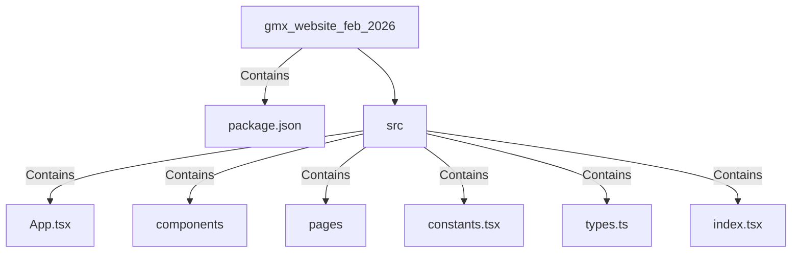

# gmx_website_feb_2026 — Developer Onboarding Guide

## Welcome
The **gmx_website_feb_2026** project is an enterprise-grade platform for AI engineering and Global Capability Center (GCC) operations, built for the 2026 AI era. This codebase powers the GyanMatrix Technologies website, a leading provider of AI-first engineering solutions and GCC services for global enterprises.

## Prerequisites
To get started with this project, you'll need the following installed on your machine:

- Node.js v19.2.0 or higher
- npm v9.5.0 or higher

This project was built using the Vite build tool, so you'll also need to have Vite installed globally:

```
npm install -g vite
```

## Getting Started

1. **Clone the repository**:
   ```
   git clone https://github.com/vasanthgyan/gmx_website_feb_2026.git
   ```

2. **Install dependencies**:
   ```
   cd gmx_website_feb_2026
   npm install
   ```

3. **Configure environment variables**:
   Create a `.env.local` file in the project root and add the following variable:
   ```
   GEMINI_API_KEY=<your_gemini_api_key>
   ```
   This API key is required to interact with the Gemini platform, which provides some of the core functionality for this application.

4. **Run the development server**:
   ```
   npm run dev
   ```
   This will start the development server and watch for changes in the codebase.

## Project Structure Walkthrough

The project is structured as follows:



- `package.json`: The project manifest, defining dependencies, scripts, and other metadata.
- `src/`: The main source code directory.
  - `App.tsx`: The root React component that renders the application.
  - `components/`: Reusable UI components used across the application.
  - `pages/`: The main pages of the website, like Home, Services, Careers, etc.
  - `constants.tsx`: Shared constants and utility functions used throughout the codebase.
  - `types.ts`: TypeScript type definitions for the project.
  - `index.tsx`: The entry point of the application.

## Key Concepts

The key concepts and domain-specific terminology used in this project include:

- **GCC (Global Capability Center)**: A centralized hub for engineering and operations, often located in India, that serves global enterprises.
- **AI Agent Development**: Building autonomous AI systems to handle customer service, sales automation, and domain-specific solutions.
- **Decision Intelligence**: AI-powered analytics that drive decisions through predictive engines, risk modeling, and optimization systems.
- **AI Product Development**: Building AI-powered products and features for global enterprises.

## Development Workflow

1. **Branch Naming**: Use the following branch naming convention: `{type}/{issue-or-feature-description}`, where `type` can be `feature`, `bug`, `refactor`, or `chore`.
2. **Running Tests**: There are no automated tests set up in this project currently, but you can manually test the application by running `npm run dev` and verifying the functionality.
3. **Building the Application**: To build the production-ready version of the application, run `npm run build`. This will generate the optimized, static files in the `dist/` directory.
4. **Deployment**: The application is currently set up to be deployed to a static hosting service like Netlify or Vercel. After running `npm run build`, you can upload the contents of the `dist/` directory to your hosting platform.

## Common Tasks

### Adding a New API Endpoint
1. Identify the relevant page or component that needs the new API endpoint.
2. Create a new function in the `constants.tsx` file to handle the API request.
3. Update the component or page to use the new API function.
4. Test the new endpoint thoroughly.

### Adding a New Page/Route
1. Create a new file in the `pages/` directory (e.g., `MyNewPage.tsx`).
2. Implement the page component and its functionality.
3. Update the `App.tsx` file to add the new route.
4. Test the new page by navigating to the corresponding URL.

### Modifying the Database Schema
This project does not use a database, as it is a static website. All data is stored in the `constants.tsx` file.

### Running Migrations
There are no database migrations in this project, as it does not use a database.

## Where to Find Things

- **Main Entry Point**: `index.tsx`
- **Routes**: Defined in the `App.tsx` file
- **Components**: Located in the `components/` directory
- **Pages**: Located in the `pages/` directory
- **Constants**: `constants.tsx`
- **Types**: `types.ts`

## FAQ & Gotchas

1. **Why is there no database in this project?**
   This is a static website project, so all data is stored in the `constants.tsx` file. There is no need for a database in this case.

2. **How do I add a new section or feature to the website?**
   Depending on the complexity of the feature, you may need to add new pages, components, and update the routing in the `App.tsx` file.

3. **Why is there no automated testing set up?**
   The project currently does not have any automated tests set up. As a new developer, you can work on adding unit and integration tests to improve the overall quality and maintainability of the codebase.

## Onboarding Difficulty Map

| Module/Area | Difficulty (1-5) | Estimated Learning Time | Key Files to Read | Prerequisites |
|------------|-----------------|----------------------|-------------------|--------------|
| Project Setup | 2 | 1-2 hours | `package.json`, `README.md` | Node.js, npm |
| Page Structure | 3 | 2-3 hours | `App.tsx`, `pages/*` | React, TypeScript |
| Components | 3 | 2-3 hours | `components/*` | React, TypeScript |
| Constants & Utilities | 3 | 2-3 hours | `constants.tsx`, `types.ts` | TypeScript |
| Deployment | 2 | 1-2 hours | `vite.config.ts` | Vite, Hosting platform |

## Recommended First Tasks

Here are five "good first issue" tasks for a new developer, ordered from easiest to hardest:

| # | Task | Difficulty | Estimated Hours | Files to Touch | What You'll Learn |
|---|------|-----------|----------------|---------------|-------------------|
| 1 | Update the README.md file with more detailed installation and setup instructions | 1 | 1-2 hours | `README.md` | Markdown, project documentation |
| 2 | Add a new page component (e.g., "FAQs") and integrate it into the routing | 2 | 2-3 hours | `pages/FAQs.tsx`, `App.tsx` | React components, routing |
| 3 | Refactor the `Gatekeeper` component to use more reusable UI elements | 3 | 3-4 hours | `components/Gatekeeper.tsx`, `components/*` | React component composition, refactoring |
| 4 | Implement a simple search functionality on the "Insights" page | 4 | 4-6 hours | `pages/Insights.tsx`, `constants.tsx` | State management, filtering, user interactions |
| 5 | Add unit tests for the `Layout` component | 4 | 4-6 hours | `components/Layout.tsx`, `tests/Layout.test.tsx` | Unit testing, testing React components |

These tasks cover a range of skills, from documentation and basic components to more complex features and testing. Completing these tasks will give you a solid understanding of the project's codebase and the technologies used.